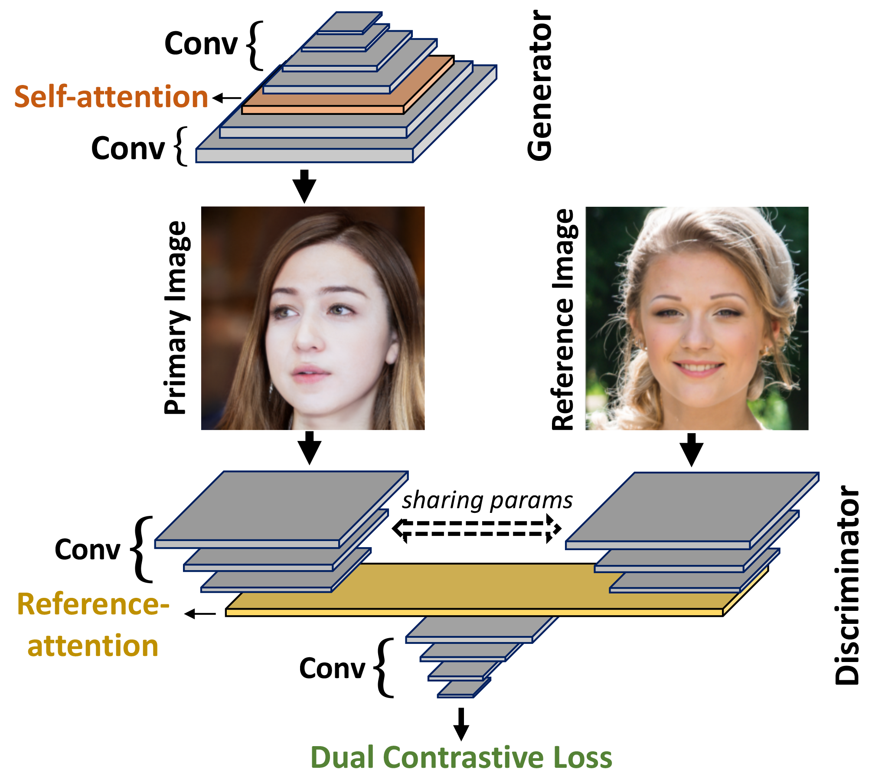

# Dual Contrastive Loss and Attention for GANs

### [Dual Contrastive Loss and Attention for GANs](https://arxiv.org/pdf/2103.16748.pdf)
[Ning Yu](https://ningyu1991.github.io/), [Guilin Liu](https://liuguilin1225.github.io/), [Aysegul Dundar](http://www.cs.bilkent.edu.tr/~adundar/), [Andrew Tao](https://scholar.google.com/citations?user=Wel9l1wAAAAJ&hl=en), [Bryan Catanzaro](https://ctnzr.io/), [Larry Davis](http://users.umiacs.umd.edu/~lsd/), [Mario Fritz](https://cispa.saarland/group/fritz/) 
ICCV 2021

### [paper](https://arxiv.org/pdf/2103.16748.pdf) | [poster](https://ningyu1991.github.io/homepage_files/poster_AttentionDualContrastGAN.pdf) | [video](https://www.youtube.com/watch?v=hviCTQJzhd0)

## Abstract
Generative Adversarial Networks (GANs) produce impressive results on unconditional image generation when powered with large-scale image datasets. Yet generated images are still easy to spot especially on datasets with high variance (e.g. bedroom, church). In this paper, we propose various improvements to further push the boundaries in image generation. Specifically, we propose a novel dual contrastive loss and show that, with this loss, discriminator learns more generalized and distinguishable representations to incentivize generation. In addition, we revisit attention and extensively experiment with different attention blocks in the generator. We find attention to be still an important module for successful image generation even though it was not used in the recent state-of-the-art models. Lastly, we study different attention architectures in the discriminator, and propose a reference attention mechanism. By combining the strengths of these remedies, we improve the compelling state-of-the-art Frechet Inception Distance (FID) by at least 17.5% on several benchmark datasets. We obtain even more significant improvements on compositional synthetic scenes (up to 47.5% in FID).
